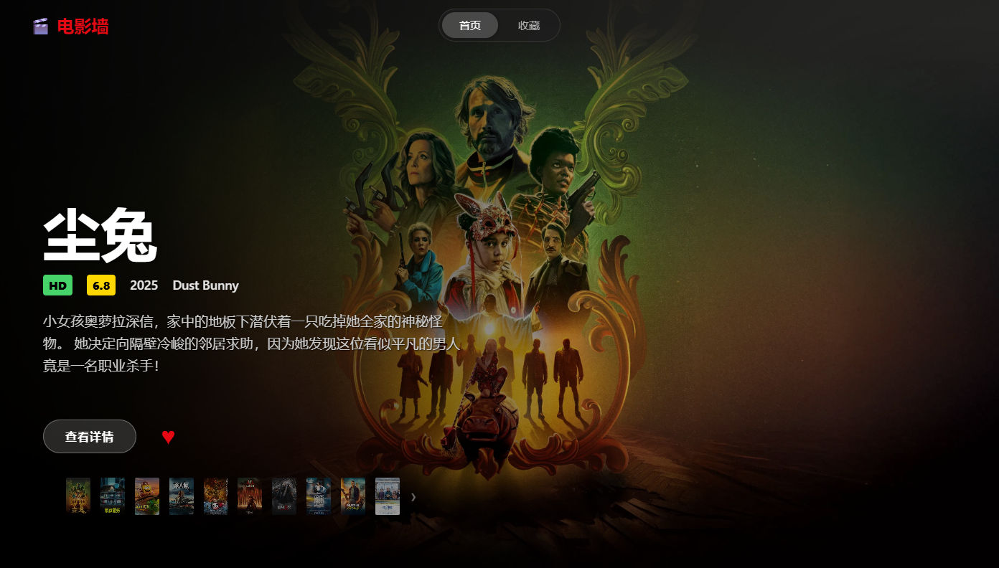
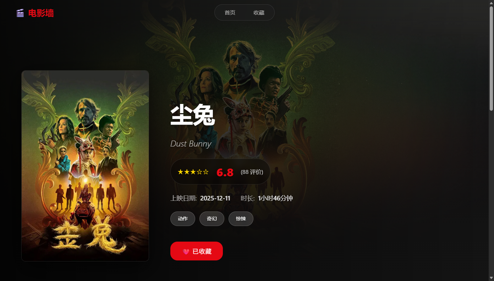
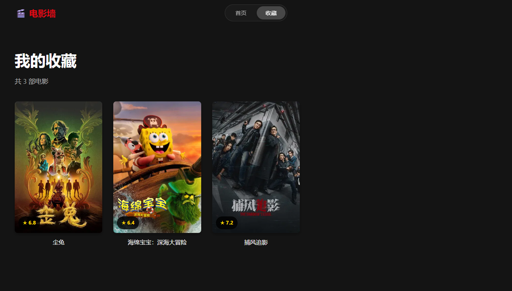

# 🎬 电影海报墙

> 一个零依赖、开箱即用的电影海报墙网页应用！

基于 HTML5、CSS3 和原生 JavaScript 的电影海报墙静态网页设计与实现（TMDB Mock 数据）

[](LICENSE)
[](https://nodejs.org/)

## 📸 项目预览

### 首页 - 沉浸式海报墙


### 详情页 - 电影信息展示


### 收藏页 - 个人收藏管理


## ✨ 功能特性

### 🎯 核心功能
- **首页电影墙**：沉浸式全屏横向滚动画廊，背景自动联动当前电影海报
- **电影详情页**：展示电影海报、标题、评分、发行日期、剧情简介、演员阵容（前8位）等完整信息
- **个人收藏**：支持收藏电影，使用 localStorage 持久化存储，随时查看

### 🎨 交互特性
- **主题切换**：深色/浅色主题一键切换，用户偏好自动保存
- **响应式设计**：完美适配 PC、平板、手机等所有屏幕尺寸
- **流畅动画**：页面切换、卡片 hover、滚动等多处精致动画效果
- **多种控制方式**：
  - 🖱️ 鼠标左右箭头
  - ⌨️ 键盘 ← → 方向键导航
  - ⏯️ 自动轮播

### 🔧 技术特性
- **纯前端实现**：无需后端，双击 HTML 即可运行
- **两种数据模式**：
  - 📝 Mock 模式：使用本地 JSON 数据，完全离线
  - 🌐 API 模式：实时获取 TMDB 官方数据
- **自动缓存**：API 数据自动写入本地 JSON，支持快速切换和离线使用
- **零外部依赖**：Server.js 仅使用 Node 原生模块，无 npm 依赖

## 🚀 快速开始

### 方式一：直接运行（最简单）

1. 找到项目文件夹
2. **双击** `index.html` 即可在浏览器中打开
3. 页面完全可用（使用本地 JSON 数据）

**优点**：无需任何配置或服务器  
**缺点**：无法使用实时 API 数据

### 方式二：使用 Live Server（推荐）

推荐使用 VS Code 的 **Live Server** 扩展：

1. 在 VS Code 中打开项目文件夹
2. 安装 [Live Server](https://marketplace.visualstudio.com/items?itemName=ritwickdey.LiveServer) 扩展
3. 右击 `index.html` → **Open with Live Server**
4. 浏览器自动打开，页面更新时自动刷新

### 方式三：启动 Node.js 本地服务

使用项目自带的 `server.js`（无需 npm 安装任何依赖）：

```powershell
# 进入项目目录
cd movie-poster-wall

# 启动服务（需要 Node.js）
node server.js
```

服务启动后，在浏览器打开：
- 首页：http://localhost:3000/index.html
- 收藏：http://localhost:3000/favorites.html
- 详情：http://localhost:3000/detail.html?id=157336

**优点**：
- 支持 API 数据自动同步到本地 JSON
- 可在 Mock 模式和 API 模式间切换
- 完整的数据持久化功能

## 📁 项目结构

```
movie-poster-wall/
├── index.html              # 首页（电影海报墙）
├── detail.html             # 详情页（电影详细信息）
├── favorites.html          # 收藏页（用户收藏列表）
├── server.js               # 本地服务（Node.js）
├── README.md               # 项目说明文档
│
├── css/                    # 样式文件
│   ├── common.css         # 公共样式（主题系统、导航栏、全局样式）
│   ├── index.css          # 首页样式（海报墙、轮播）
│   ├── detail.css         # 详情页样式（信息卡片、演员列表）
│   └── favorites.css      # 收藏页样式（网格布局、空状态）
│
├── js/                     # JavaScript 文件
│   ├── data.js            # 数据配置 + API 封装（TMDB接口、本地JSON加载）
│   ├── common.js          # 公共函数（主题切换、收藏管理、导航）
│   ├── index.js           # 首页逻辑（海报墙、轮播、事件处理）
│   ├── detail.js          # 详情页逻辑（数据展示、收藏操作）
│   └── favorites.js       # 收藏页逻辑（列表渲染、删除操作）
│
├── data/                   # 数据目录
│   ├── upcoming.json      # 即将上映电影列表（本地JSON）
│   └── movies/            # 电影详情 JSON 文件
│       ├── 1043197.json
│       ├── 1196067.json
│       └── ...（20部电影数据）
│
└── screenshots/            # 项目截图
    ├── home.png
    ├── detail.png
    └── favorites.png
```

## ⚙️ 配置说明

### 数据模式切换

在 `js/data.js` 中修改以下配置：

```javascript
const CONFIG = {
  USE_MOCK: true,              // true: 本地JSON，false: TMDB API
  TMDB_TOKEN: '',           // TMDB API Token（需要到官方申请）
  TMDB_BASE_URL: "https://api.themoviedb.org/3",
  IMAGE_BASE_URL: "https://image.tmdb.org/t/p",
  LOCAL_DATA_BASE: "./data",   // 本地数据目录
  LOCAL_SYNC_BASE: "/sync"     // 同步写入接口（需要 Node.js 服务器）
};
```

### 使用 Mock 本地数据（默认）

**无需任何配置，项目默认已启用。** 所有数据存储在 `data/` 目录中：

```
data/
├── upcoming.json              # 即将上映电影列表
└── movies/
    ├── 157336.json           # 电影详情数据（按 TMDB ID）
    ├── 639988.json
    └── ...（共20部电影）
```

**优点**：
- ✅ 完全离线，不受网络限制
- ✅ 数据始终可用
- ✅ 无需 API Token

### 使用 TMDB 真实 API

1. **获取 API Token**
   - 访问 [TMDB 官方](https://www.themoviedb.org/settings/api)
   - 登录或注册账户
   - 申请 API Token（需要填写应用信息）

2. **配置 Token**
   - 在 `js/data.js` 中找到 `const tmdb_token = '';`
   - 替换为：`const tmdb_token = "你的Token";`

3. **启用 API 模式**
   - 确保 `USE_MOCK: false`（或自动检测）
   - 刷新页面，即可使用实时数据

4. **数据自动同步**
   - 使用 Node.js 服务器运行项目
   - API 获取的数据会自动写入 `data/` 目录
   - 后续可切换回 Mock 模式使用已缓存的数据

### 本地 JSON 与自动同步

- **读取**：优先读取本地 JSON 文件
- **降级**：本地 JSON 不存在时，回退到内置 Mock 数据
- **同步**：API 模式成功获取数据后，自动写入对应 JSON 文件

写入接口（由 `server.js` 提供）：
```
POST /sync/upcoming          → data/upcoming.json
POST /sync/movie/:id        → data/movies/:id.json
```

## 🛠️ 技术栈

### 前端框架
- **HTML5**：语义化标签，无框架依赖
- **CSS3**：
  - CSS 变量实现深色/浅色主题系统
  - Flexbox 和 Grid 布局
  - 过渡和动画效果
  - 响应式媒体查询
- **JavaScript ES6+**：
  - 原生 DOM 操作（无 jQuery）
  - Fetch API 处理网络请求
  - localStorage 数据持久化
  - 模块化代码组织

### 后端支持（可选）
- **Node.js**：原生 HTTP 服务器
- **无依赖**：仅使用 Node 内置模块（fs、path、http）

### 数据源
- **本地 JSON**：静态电影数据文件
- **TMDB API**：可选的实时数据接口

### 主题系统
使用 CSS 变量实现主题切换（在 `css/common.css` 中定义）：
```css
:root {
    /* 深色主题默认值 */
    --bg-primary: #141414;          /* 主背景色 */
    --bg-secondary: #222222;        /* 次背景色 */
    --text-primary: #ffffff;        /* 主文字色 */
    --text-secondary: #b0b0b0;      /* 次文字色 */
    --accent: #e50914;              /* 强调色（Netflix红） */
    --border-color: #404040;        /* 边框色 */
}

html[data-theme="light"] {
    /* 浅色主题覆盖 */
    --bg-primary: #f5f5f5;
    --text-primary: #000000;
    /* ... */
}
```

## 🌐 浏览器兼容性

| 浏览器 | 最低版本 | 支持情况 |
|-------|---------|--------|
| Chrome | 90+ | ✅ 完全支持 |
| Edge | 90+ | ✅ 完全支持 |
| Firefox | 88+ | ✅ 完全支持 |
| Safari | 14+ | ✅ 完全支持 |
| Chrome Mobile | 90+ | ✅ 完全支持 |
| Safari iOS | 14+ | ✅ 完全支持 |

**兼容性说明：**
- 需要支持 ES6 语法（async/await、箭头函数等）
- 需要支持 Fetch API
- 需要支持 CSS 变量
- 移动端完全支持触摸事件

## 📚 API 与数据来源

### TMDB（The Movie Database）

本项目使用 TMDB 提供的电影数据接口：

- **官方网站**：https://www.themoviedb.org
- **API 文档**：https://developers.themoviedb.org/3
- **图片 CDN**：https://image.tmdb.org/t/p/
- **申请 Token**：https://www.themoviedb.org/settings/api

**TMDB 优势：**
- 完整的电影信息数据库
- 高质量的海报和剧照
- 支持多语言内容
- 免费 API 配额充足

### 本项目数据

项目包含 20 部电影的完整数据：

```json
// data/upcoming.json 示例
{
  "results": [
    {
      "id": 157336,
      "title": "超能陆战队",
      "poster_path": "/path/to/poster.jpg",
      ...
    },
    ...
  ]
}
```

所有电影详情存储在 `data/movies/<id>.json` 中，包含：
- 基本信息（标题、评分、发行日期）
- 中文标题和描述
- 海报和背景图片
- 演员和制片公司信息

## 📄 许可证

本项目仅用于学习和教育目的。

- **电影数据**：来自 TMDB（The Movie Database），版权归原作者及相关权利人所有
- **项目代码**：自由使用和修改，仅供学习之用
- **免责声明**：本项目不对电影信息的准确性和完整性做任何保证

## 🎉 致谢

感谢以下资源的支持：
- [TMDB](https://www.themoviedb.org) - 提供电影数据和 API
- [MDN Web Docs](https://developer.mozilla.org/) - Web 开发文档
- [Can I Use](https://caniuse.com/) - 浏览器兼容性查询

---

**最后更新**：2026年5月11日  
**项目版本**：1.0.0
